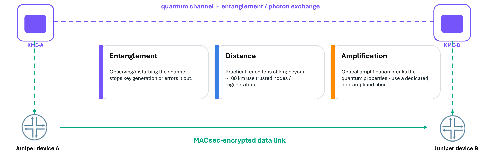
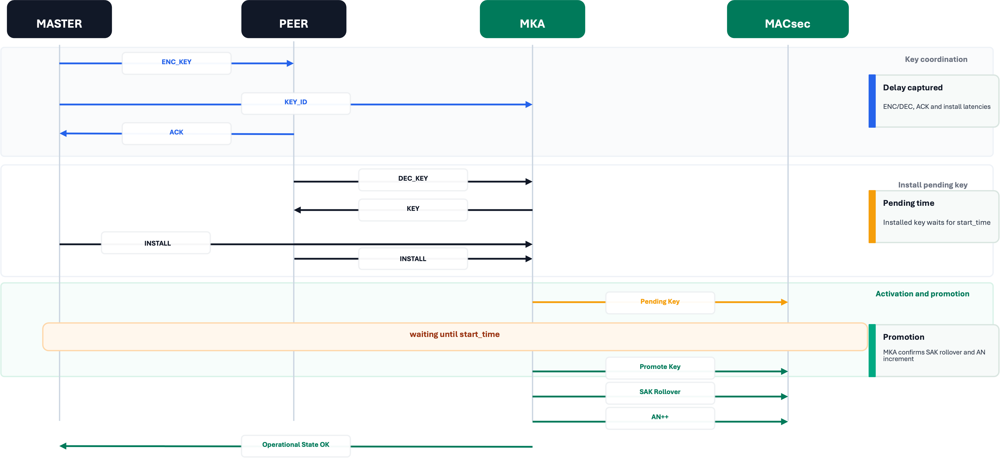
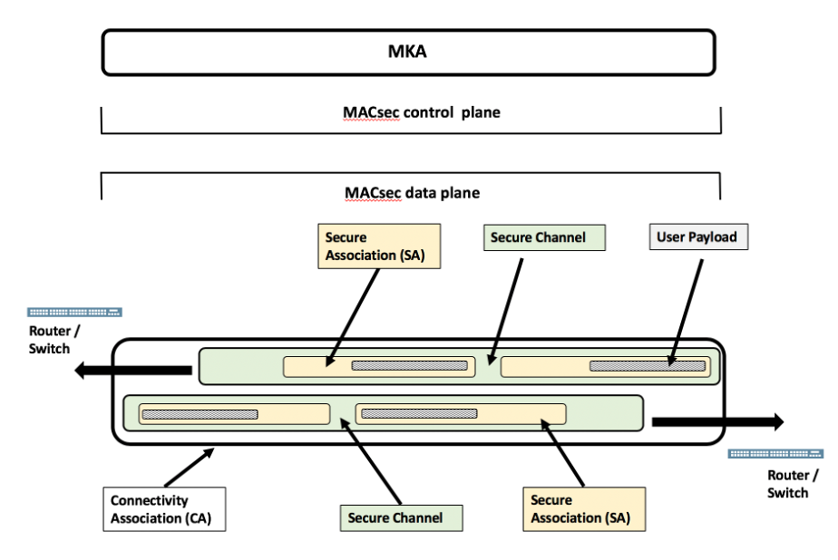
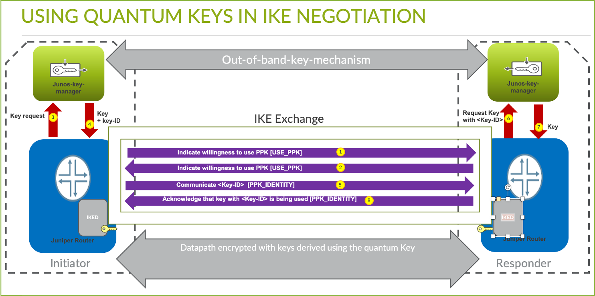
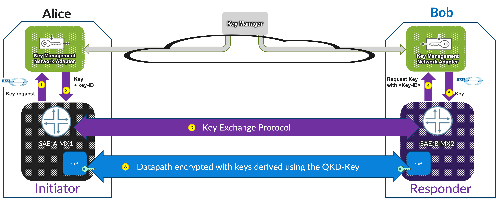

# Quantum-Safe MACsec on Juniper devices - High-Level Design

## 1. Purpose

This repository implements a production-oriented framework for **QKD-assisted MACsec**:

- MACsec provides line-rate L2 encryption on Juniper devices.
- QKD/KME provides externally sourced key material and key identifiers.
- Python orchestration ties the two domains into a deterministic operational model.

The design goal is to deliver **hitless key rotation**, stable control plane behavior, and reproducible deployment workflows.

---

## 2. Why this architecture

The primary driver is quantum-era risk: data encrypted today may be harvested and decrypted later.  
This framework addresses that by combining:

1. standards-based MACsec/MKA data protection,
2. ETSI-style KME key delivery APIs,
3. automated key-id coordination between peers,
4. operational controls for safe rotation and rollback.

---

## 3. End-to-end architecture view

The system is split into network encryption, key management, and orchestration/control layers.



### 3.1 What this view shows

- **Data plane**: MACsec-secured ACX links.
- **Key service plane**: one KME/QKD service context per participating node/link set.
- **Control plane**: orchestrators generate artifacts, install certs, deploy scripts/config, and validate runtime.

---

## 4. Packet and key exchange concept

This view describes the practical packet/key lifecycle at high level.



### 4.1 Core idea

- Key **material** is fetched from KME endpoints.
- Key **identity** (`key_id`) is coordinated across peers.
- MACsec transitions from pending to active keys after MKA confirmation.

---

## 5. MACsec control-plane vs data-plane behavior

The model explicitly separates MKA coordination from encrypted traffic flow.



### 5.1 Why it matters

- Control plane instability causes tunnel churn even if key material exists.
- This framework optimizes for stable MKA state while rotating key material in the background.

---

## 6. QKD/KME exchange model

This section captures the KME interaction concept that underpins key delivery.



### 6.1 Exchange logic

1. master side requests `enc_keys` and receives `key_id`,
2. peer side uses that `key_id` to request matching `dec_keys`,
3. both sides schedule/install keys for MACsec continuity.

---

## 7. Rotation sequence used by the implementation

The detailed sequence below reflects how the project turns API key retrieval into MACsec state transitions.



### 7.1 Expected operational markers

- `ENC OK key_id=...`
- `DEC OK key_id=...`
- `INSTALL-KEY SCHEDULE ... key_id=...`
- `MKA KEY CONFIRMED key_id=...`
- `PENDING KEY PROMOTED active_key_id=...`

---

## 8. Automation architecture (repository implementation)

### 8.1 QKD orchestrator (`qkd_orchestrator.py`)

Responsibilities:

- inventory/link validation (`topology: links`)
- runtime generation under `config/runtime/`
- PKI generation under `certs/`
- per-device `qkd_onbox.py` artifact generation
- deployment/validation/cleanup lifecycle

Main commands:

- `create`
- `deploy`
- `validate`
- `clean`

### 8.2 KME orchestrator (`kme_orchestrator.py`)

Responsibilities:

- remote host bootstrap and dependency setup
- compose/image lifecycle for ETSI KME runtime
- certificate installation (cert generation remains QKD-owned)
- DB init, deploy, status, restart, validate, stop, destroy

Main commands:

- `create`, `bootstrap`, `install-host`, `build-env`, `build-image`
- `install-certs`, `db-init`, `deploy`
- `status`, `restart`, `validate`, `stop`, `destroy`

---

## 9. Typical deployment flow

### 9.1 QKD side

```bash
python3 qkd_orchestrator.py create --inventory <inventory_name> --pki-profile hierarchical_ca
python3 qkd_orchestrator.py deploy
python3 qkd_orchestrator.py validate --phase postdeploy
```

### 9.2 KME side

```bash
python3 kme_orchestrator.py build-env --config config/kme/live.yaml --count 2
python3 kme_orchestrator.py install-certs --config config/kme/live.yaml
python3 kme_orchestrator.py deploy --config config/kme/live.yaml
python3 kme_orchestrator.py validate --config config/kme/live.yaml
```

---

## 10. Lab outcomes reflected in this design

The framework is structured around measured behaviors from lab validation:

- long-duration ring tests with stable LACP/MKA behavior,
- periodic key rotation without per-cycle interface commit churn,
- deterministic logs for troubleshooting and customer summaries.

Customer summary utility:

- `lib/qkd/log_summary.py`

---

## 11. Repository map

- `qkd_orchestrator.py` - QKD/MACsec orchestration entrypoint
- `kme_orchestrator.py` - KME orchestration entrypoint
- `lib/qkd/` - QKD runtime + deployment logic
- `lib/kme/` - KME lifecycle + deployment logic
- `config/` - inventory/runtime/kme environment config
- `artifacts/` - on-box template(s)
- `docs/` - architecture, CLI references, standards/theory
- `test/` - active scripts and representative samples
- `archive/` - historical materials for traceability

---

## 12. Detailed documentation

1. `docs/README.md`
2. `docs/qkd/ARCHITECTURE.md`
3. `docs/kme/ARCHITECTURE.md`
4. `docs/pqc/THEORY_AND_STANDARDS.md`
5. `docs/qkd/CLI_REFERENCE.md`
6. `docs/kme/CLI_REFERENCE.md`
7. `docs/pqc/GLOSSARY.md`
